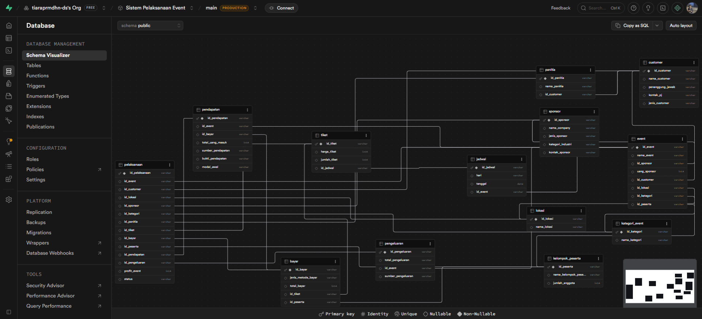

# 🎫 Event Organizer Database Management System

Perancangan sistem basis data relasional untuk mengelola operasional **Event Organizer**, mulai dari pengelolaan customer, event, sponsor, peserta, tiket, transaksi pembayaran, hingga pencatatan pendapatan dan pengeluaran.

Project ini merupakan implementasi konsep **Database Management System (DBMS)** menggunakan **Supabase (PostgreSQL)** sebagai studi kasus pengembangan sistem informasi Event Organizer.

---

# 🏢 Business Context

Sebuah Event Organizer membutuhkan sistem yang mampu mengelola berbagai aktivitas operasional dalam satu database terintegrasi. Data seperti customer, event, sponsor, lokasi, peserta, panitia, tiket, transaksi pembayaran, hingga laporan keuangan saling berhubungan dan harus dikelola secara konsisten agar proses operasional berjalan lebih efisien.

Melalui project ini, seluruh kebutuhan tersebut dimodelkan ke dalam sebuah **database relasional** sehingga data dapat disimpan, dikelola, dan diakses dengan lebih terstruktur serta mudah dikembangkan.

---

# 🎯 Project Objectives

Project ini bertujuan untuk:

- Merancang struktur database relasional berdasarkan kebutuhan sistem Event Organizer.
- Mendesain hubungan antar entitas menggunakan Entity Relationship Diagram (ERD).
- Mengimplementasikan database menggunakan PostgreSQL.
- Menyiapkan dummy data sebagai simulasi operasional sistem.
- Mengembangkan script SQL untuk manipulasi data dan contoh query.
- Mendokumentasikan proses perancangan database dalam bentuk presentasi.

---

# 📌 Database Scope

Database dirancang untuk mendukung berbagai proses bisnis dalam operasional Event Organizer.

| Modul | Deskripsi |
|--------|-----------|
| 👥 Customer | Mengelola data customer penyelenggara event. |
| 🎉 Event | Mengelola informasi event yang diselenggarakan. |
| 🤝 Sponsor | Mengelola data sponsor beserta kontribusinya. |
| 📍 Venue | Mengelola lokasi pelaksanaan event. |
| 📅 Schedule | Mengelola jadwal setiap event. |
| 🎟 Ticket | Mengelola data tiket beserta harga dan kuota. |
| 👨‍👩‍👧‍👦 Participant Group | Mengelola kelompok peserta yang mengikuti event. |
| 👨‍💼 Committee | Mengelola data panitia penyelenggara. |
| 💳 Payment | Mengelola transaksi pembayaran peserta. |
| 💰 Revenue | Mencatat seluruh pemasukan event. |
| 💸 Expense | Mencatat seluruh biaya operasional event. |
| 📊 Event Implementation | Menghubungkan seluruh aktivitas operasional menjadi satu kesatuan. |

---

# 🗺️ Entity Relationship Diagram (ERD)

Database diimplementasikan menggunakan **Supabase (PostgreSQL)**. Setelah seluruh tabel dan relasi selesai dibuat, struktur database divisualisasikan menggunakan fitur **Schema Visualizer** sehingga hubungan antar entitas dapat terlihat dengan lebih jelas.

<p align="center">
  
</p>

---

# 🧪 Dummy Data

Repository ini juga menyediakan **dummy data** sebagai simulasi data operasional Event Organizer.

Dummy data disusun menggunakan **Google Sheets**, kemudian digunakan sebagai referensi dalam proses pengisian database sehingga struktur yang dirancang dapat diuji menggunakan data yang menyerupai kondisi nyata.

---

# 💻 Database Scripts

Seluruh implementasi database disusun secara bertahap sehingga setiap proses dapat dipelajari dengan mudah.

| File | Deskripsi |
|------|-----------|
| **01_schema.sql** | Membuat seluruh tabel beserta Primary Key, Foreign Key, dan relasi antar tabel. |
| **02_seed_data.sql** | Mengisi database menggunakan dummy data. |
| **03_data_manipulation.sql** | Berisi contoh operasi INSERT, UPDATE, DELETE, ALTER TABLE, dan TRUNCATE. |
| **04_query_examples.sql** | Berisi berbagai contoh query SQL seperti SELECT, JOIN, filtering, agregasi, dan analisis sederhana. |

---

# 📑 Presentation

Seluruh proses perancangan database mulai dari analisis kebutuhan, desain database, implementasi SQL, hingga hasil akhir project didokumentasikan dalam file presentasi berikut.

📄 **presentation/sistem-basis-data-manajemen-event.pdf**

---

# 📂 Project Structure

```text
.
├── assets/
│   └── erd.png
│
├── data/
│   └── dummy_data.xlsx
│
├── database/
│   ├── 01_schema.sql
│   ├── 02_seed_data.sql
│   ├── 03_data_manipulation.sql
│   └── 04_query_examples.sql
│
├── presentation/
│   └── sistem-basis-data-manajemen-event.pdf
│
└── README.md
```

---

# 🛠 Tools

| Category | Tools |
| --- | --- |
| Database | Supabase (PostgreSQL) |
| Database Modeling | Supabase Schema Visualizer |
| Spreadsheet | Google Sheets |
| Documentation & Presentation | Canva |
| Version Control | Git & GitHub |

---

# 💼 Skills Demonstrated

### 🗄 Database Design

- Relational Database Design
- Entity Relationship Modeling (ERM)
- Relationship Management
- Database Schema Design

### 💻 SQL

- Data Definition Language (DDL)
- Data Manipulation Language (DML)
- SELECT Query
- JOIN
- Aggregate Functions
- Filtering & Sorting

### 📊 Data Management

- Dummy Data Preparation
- Database Seeding
- Data Integrity

### 📑 Documentation

- Technical Documentation
- Database Presentation

---

# 🚀 Conclusion

Project ini menunjukkan proses perancangan sebuah **database relasional** untuk sistem Event Organizer, mulai dari analisis kebutuhan, pemodelan database, implementasi menggunakan **Supabase (PostgreSQL)**, penyusunan dummy data, hingga dokumentasi dalam bentuk presentasi.

Melalui project ini, konsep-konsep utama **Database Management System (DBMS)** seperti perancangan relasi antar entitas, implementasi SQL, serta pengelolaan data diterapkan secara menyeluruh sehingga menghasilkan database yang terstruktur, konsisten, dan siap dikembangkan untuk kebutuhan sistem yang lebih kompleks.
